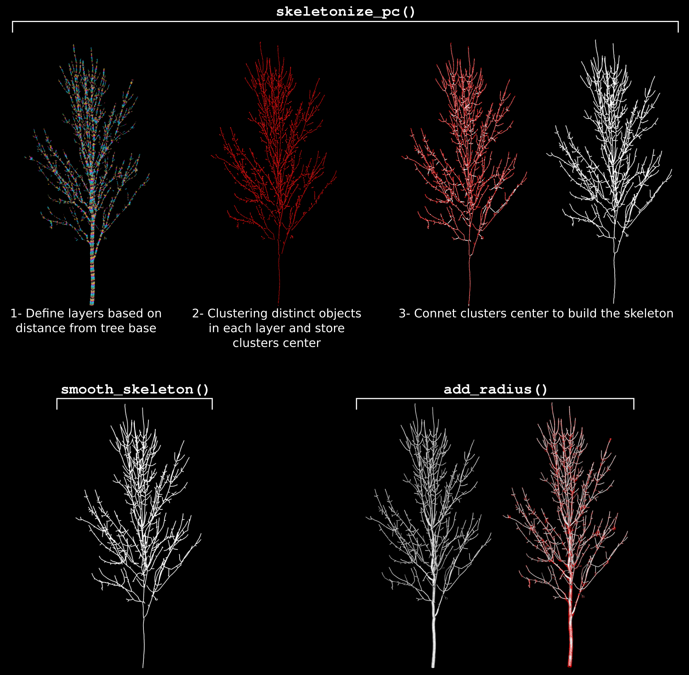
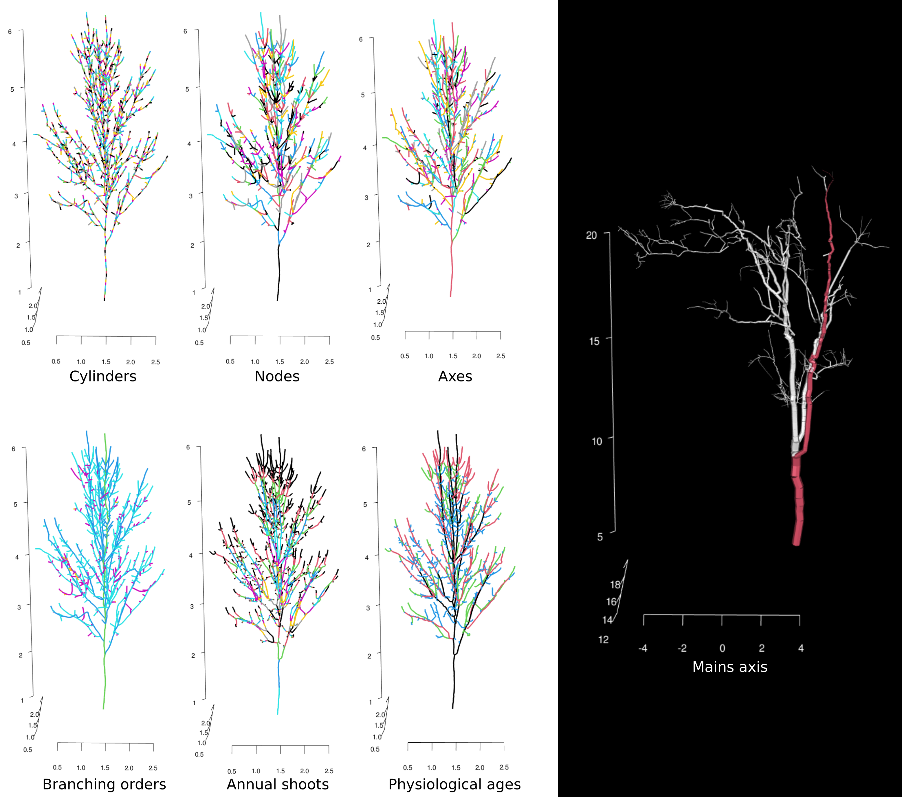
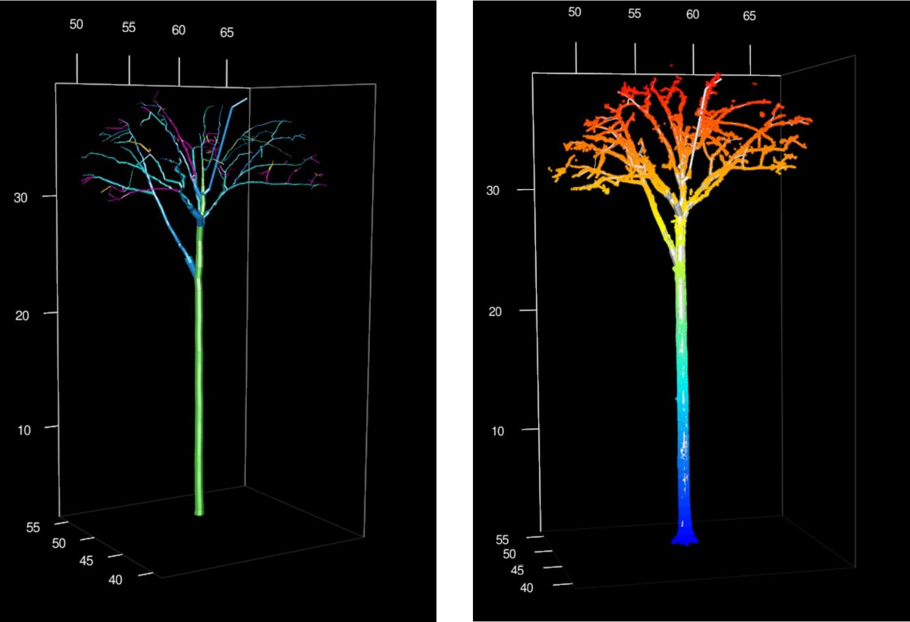
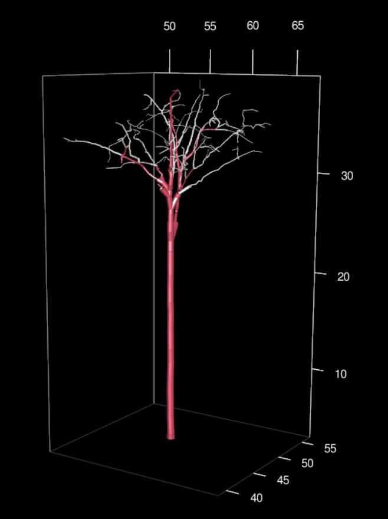
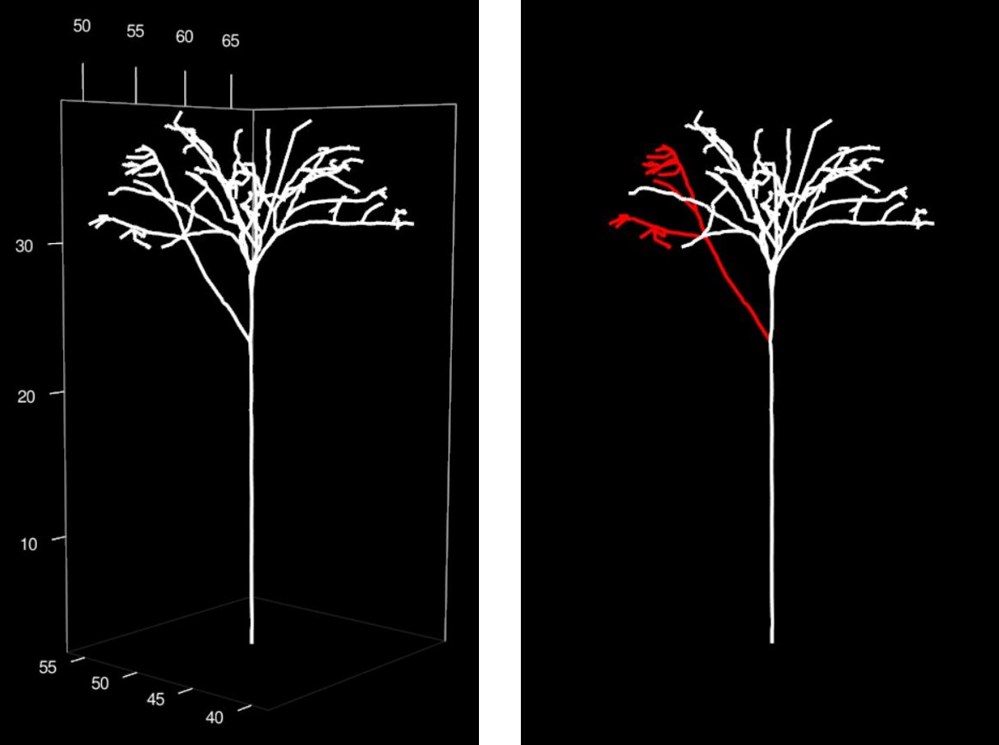

# aRchi

-   [The package](#the-package)
-   [Install aRchi](#install-archi)

## The package

R package that provides a set of tools to manipulate, visualize and
compute metrics from quantitative structural model of trees (i.e the
so-called ‘QSM’) . It can be used in various context of forest ecology
(i.e biomass estimation) and tree architecture (i.e architectural
metrics). The package is based on a new S4 class called ‘aRchi’.

### The class aRchi

All the function allowing visualization, metrics computation or QSM
modification needs an object of class aRchi as input. A class archi can
be build using the *build_aRchi()* function.

This Class contains five slots:

1.  The QSM of a tree. See next section for more details.
2.  The point cloud that was used to generate the QSM. It can be
    imported as XYZ data.frame/data.table or a LAS.
3.  The paths. It can be constructed using the *Make_path()* function
    and is needed for several metric computation and QSM modifications.
4.  The nodes. It can be constructed using the *Make_Node()* function
    and is required only for some metrics (see function
    *WBEparameters()* or *LeonardoRatio()* for example)
5.  The operations. It records all the operations that have been made on
    the aRchi object (QSM modifications, paths and node construction…)

### Import and build QSMs in aRchi
<<<<<<< HEAD
=======
The *read_QSM()* function provides methods to import QSMs generated by some of the most commonly used QSM models (treeQSM (last version and even .mat file),
SimpleTree, SimpleForest and pypeTree). The imported QSMs are automatically converted into a common 
QSM format defined in the aRchi class.
>>>>>>> 0bff81fde4fac571abe9012b71f15af0c32c2613

The *read_QSM()* function provides methods to import QSMs generated by
some of the most commonly used QSM models (treeQSM, SimpleTree,
SimpleForest and pypeTree). The imported QSMs are automatically
converted into a common QSM format defined in the aRchi class.

Since the version 2.1.0 of the package, aRchi also provides the
possibility to generate QSMs. To do so, three functions are provided :

-   *skeletonize_pc()* allow to build a skeleton.
-   *smooth_skeleton()*.
-   *add_radius()* computes the radius of each cylinder based on point
    distance to the skeleton.

The aRchi's QSM method was designed to build very detailed QSMs from
high quality TLS scans. However, it also allow to quickly reconstruct
the coarse architecture of large point clouds of lower quality. A basic
explaination of QSMs building in aRchi is shown in the figure bellow.


aRchi also allow to add the non reconstructed axes to a QSM using the
*add_non_reconstructed()* function.

### Tree topology in aRchi

aRchi provides the ability to compute many topological informations from
a QSM :

-   *build_aRchi()* and *skeletonize()* include the computation of a
    basic tree topology at different levels of the tree architecture
    (cylinders, nodes, axes and branching orders).
-   *segment_annual_shoots()* segments annual shoots in QSM of trees
    that exhibit acrotonic growth pattern.
-   *add_physiological_ages()* class annual shoots into *N*
    physiological ages based on their length.
-   *compute_AO()* automatically identify the dominant axis of a tree
    based on the informations available in the QSM.
    

### Visualyzation and interaction (some tips)

It is possible to visualize the QSM with or without the point cloud and
showing only the skeleton or the whole QSM (i.e with cylinder volume) in
a 3D interactive window using the function *plot()*. Different level of
organization such as branch order, segment or cylinder can be colorized.

3d plot with Branch order colorized or the QSM with point cloud:



Some function allows modifying the QSM (e.g *cleanQSM()*,
*TruncateQSM()*, *simplify_skeleton()*) and propose a visualization of
the results.

The kept part in red and the removed part in white obtained with
*TruncateQSM()*:



It is also possible to select a part of the QSM in a 3D interactive
window by following the instruction of the function *selectinQSM_3d()*.
It allows selecting different level of organization (cylinder, branch,
segment, node….) and return a table of the selected part of the QSM with
all the informations available. For example, If the biomass and
mechanical constrains have been computed using *Compute_mf()* function,
the returned table will contains the biomass and moment of force of all
the cylinders/segments/node… selected.

Select a part of the QSM by following *selectinQSM_3d()* function
instruction:



All the characteristics of the selected part are returns:


For more information on some metrics such as WBE parameters
(*WBEparameters()*), Dominance apical index (*DAI()*), fork rate
(*ForkRate()*) or branch angle (*BranchAngle()*) see
[article](https://doi.org/10.1111/1365-2435.13678).

## Install aRchi

The latest released version from CRAN:

``` r
install.packages("aRchi")
```

The latest version from Github (in development):

``` r
install.packages("remotes")
remotes::install_github('umr-amap/aRchi')
```

To use it :

``` r
library("aRchi")
```
