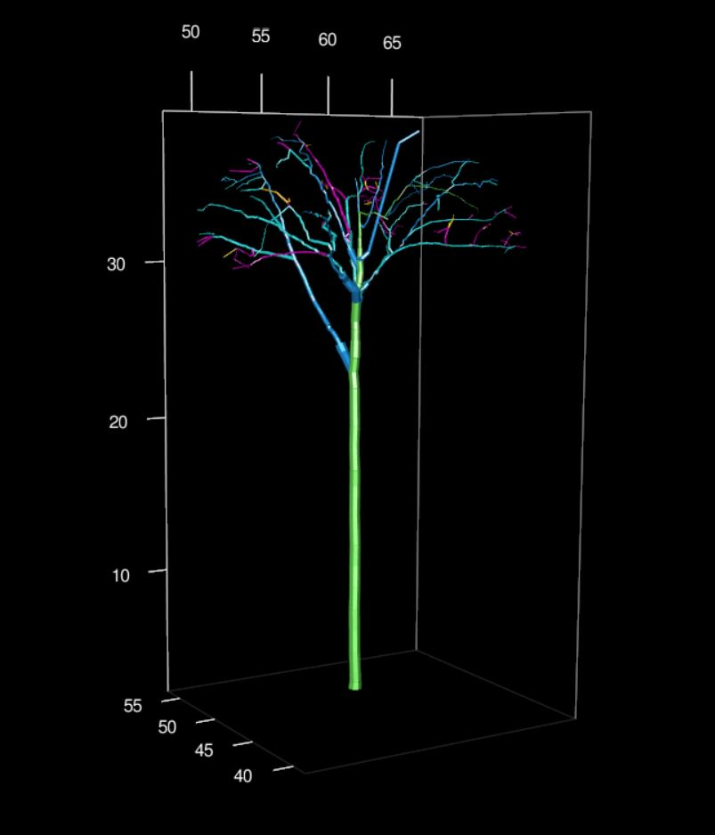
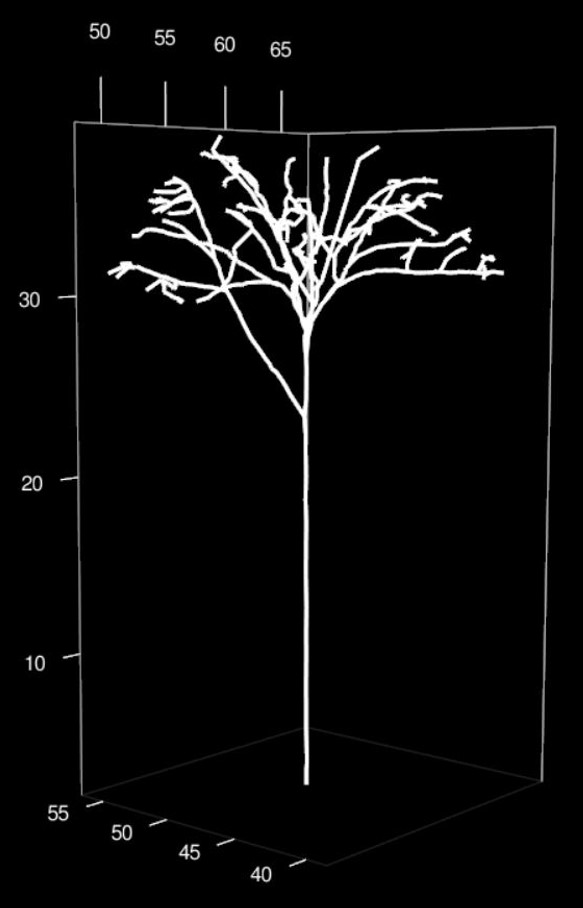
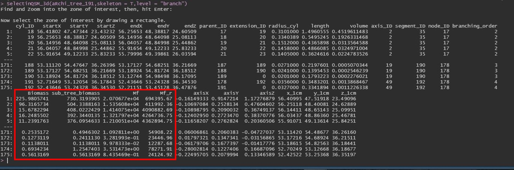

```{r setup, include=FALSE}
knitr::opts_chunk$set(echo = TRUE, eval = FALSE)
```

## The package

R package that provides a set of tools to manipulate, visualize and compute metrics from quantitative structural model of trees (i.e the so-called 'QSM') . It can be used in various context of forest ecology (i.e biomass estimation) and tree architecture (i.e architectural metrics). The package is based on a new S4 class called 'aRchi'.

### The class aRchi

All the function allowing visualization metrics computation or QSM modification needs an object of class aRchi as input. A class archi can be build using the *build_aRchi()* function.

This Class contains five slots:

1. The QSM of tree. It can be imported in different format (*TreeQSM*,*Simpletree*,*pypetree*...). see function *readQSM()* function.
2. The point cloud. It can be imported as XYZ data.frame/data.table or a LAS.
3. The paths. It can be constructed using the *Make_path()* function and is needed for several metric computation and QSM modifications.
4. The nodes. It can be constructed using the *Make_Node()* function and is required only for some metrics (see function *WBEparameters()* or *LeonardoRatio()* for example)
5. The operations. It records all the operations that have been made on the aRchi object (QSM modifications, paths and node construction...)


### Visualyzation and interaction (some tips)


It is possible to visualize the QSM with or without the point cloud and showing only the skeleton or the whole QSM (i.e with cylinder volume) in a 3D interactive window using the function *plot()*. Different level of organization such as branch order, segment or cylinder can be colorized.  


3d plot with Branch order colorized or the QSM with point cloud:




Some function allows modifying the QSM (e.g *cleanQSM()*, *TruncateQSM()*) and propose a visualization of the results.


The kept part in red and the removed part in white obtained with *TruncateQSM()*:


It is also possible to select a part of the QSM in a 3D interactive window by following the instruction of the function *selectinQSM_3d()*. It allows selecting different level of organization (cylinder, branch, segment, node....) and return a table of the selected part of the QSM with all the informations available. For example, If the biomass and mechanical constrains have been computed using *Compute_mf()* function, the returned table will contains the biomass and moment of force of all the cylinders/segments/node... selected.


Select a part of the QSM by following *selectinQSM_3d()* function instruction:




All the characteristics of the selected part are returns:




For more information on some metrics such as WBE parameters (*WBEparameters()*), Dominance apical index (*DAI()*), fork rate (*ForkRate()*) or branch angle (*BranchAngle()*) see [article](https://besjournals.onlinelibrary.wiley.com/doi/10.1111/1365-2435.13678).

## Install aRchi

The latest released version from CRAN:
```{r}
install.packages("aRchi")
```

The latest version from Github (in development):
```{r}
install.packages("remotes")
remotes::install_github('umr-amap/aRchi')
```

To use it :
```{r}
library("aRchi")
```
